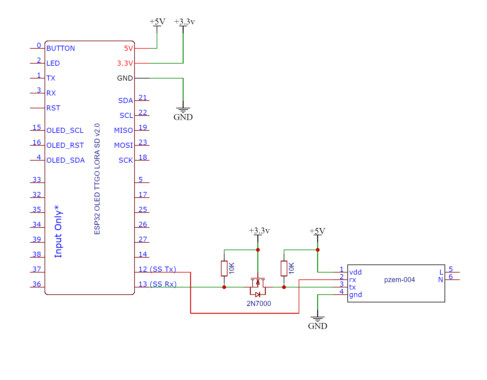

## Energy Meter with LoRaWAN

A LoRaWAN enabled Energy Meter using TTGO ESP32 board and PZEM-004T Energy Monitoring module. 

### Libraries Used:

1. [Arduino-LMIC](https://github.com/mcci-catena/arduino-lmic)
2. [U8glib Library for OLED](https://github.com/olikraus/u8g2)
3. [SoftwareSerial](https://github.com/plerup/espsoftwareserial)

### ESP32 Pin Diagram:-


### Connection Diagram:-



### The Energy Meter data is sent to TTN as raw bytes and decoded in TTN using the following piece of code in decoder in Payyload Format,

```js
function Decoder(bytes, port) {
    var decoded = {};

    var voltage = (bytes[0] << 8) + bytes[1] +(bytes[2] / 10.0);
    var power = (bytes[3] << 8) + bytes[4];
    var energy = (bytes[5] << 16) + (bytes[6] << 8) + bytes[7];


    decoded.voltage = voltage;
    decoded.current = voltage > 0 ? power / voltage : 0;
    decoded.power = power;
    decoded.energy = energy;
    
    return decoded;
}
}
```